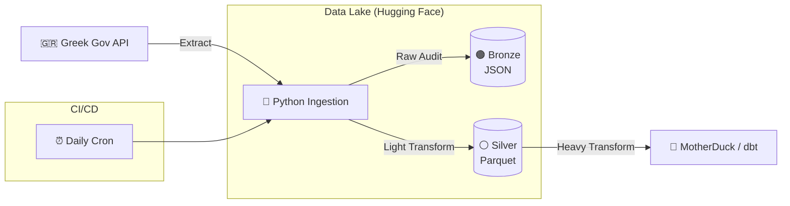

<h1 align="center">🚗 Attica Traffic Analysis</h1>

<p align="center">
  <i>Which is the busiest time slot?</i> • <i>Does total vehicle volume correlate with average network speed?</i> • <br>
  <i>Which are the most and least volatile roads?</i>
  <br>
</p>

<p align="center"><b>A high-performance, resilient ELT pipeline <br> designed to capture, archive and analyze traffic data from Attica, Greece.</b></p>
<p align="center">This project implements a Medallion Architecture, <br> optimizing for both data fidelity and analytical speed. <br> By separating the "Extract & Load" (Python) from the "Transform" (dbt), <br>both orchestrated by Github Actions, <br> the pipeline ensures a robust source of truth <br> while keeping the analytics layer agile. <br> Analytics dashboards are presented through Streamlit.</p>


<p align="center">
  <a href="https://www.python.org/"></a>
  <a href="https://docs.github.com/en/actions/"></a>
  <a href="https://huggingface.co/docs/datasets/index"></a>
  <a href="https://www.getdbt.com//"><svg height="42" fill="#ff694a" viewBox="0 0 24 24" role="img" xmlns="http://www.w3.org/2000/svg"><g id="SVGRepo_bgCarrier" stroke-width="0"></g><g id="SVGRepo_tracerCarrier" stroke-linecap="round" stroke-linejoin="round" stroke="#CCCCCC" stroke-width="0.048"></g><g id="SVGRepo_iconCarrier"><path d="M17.9 9.376a8.149 8.149 0 0 0-3.042-3.12l1.771.838a10.287 10.287 0 0 1 3.74 3l3.234-5.929a2.855 2.855 0 0 0-.061-2.96 2.726 2.726 0 0 0-3.567-.872L14.1 3.543a4.361 4.361 0 0 1-4.176 0L4.177.408a2.854 2.854 0 0 0-2.96.063 2.726 2.726 0 0 0-.872 3.566L3.55 9.91a4.361 4.361 0 0 1 0 4.177L.423 19.83a2.86 2.86 0 0 0 .085 2.997 2.726 2.726 0 0 0 3.545.839l6.058-3.305a10.288 10.288 0 0 1-3.005-3.746l-.838-1.77a8.148 8.148 0 0 0 3.12 3.042l10.584 5.779a2.726 2.726 0 0 0 3.543-.837 2.87 2.87 0 0 0 .08-3.001L17.9 9.376zm3.38-7.735a1.09 1.09 0 1 1 0 2.181 1.09 1.09 0 0 1 0-2.18zM2.744 3.822a1.09 1.09 0 1 1 0-2.18 1.09 1.09 0 0 1 0 2.18zm0 18.536a1.09 1.09 0 1 1 0-2.18 1.09 1.09 0 0 1 0 2.18zM13.103 10.91a2.174 2.174 0 0 0-2.18 2.168 2.174 2.174 0 0 0 .704 1.61 2.72 2.72 0 1 1 .758-5.386 2.72 2.72 0 0 1 2.314 2.314 2.162 2.162 0 0 0-1.596-.706zm8.177 11.45a1.09 1.09 0 1 1 0-2.182 1.09 1.09 0 0 1 0 2.181z"></path></g></svg></a>
  <a href="https://motherduck.com/"></a>
  <a href="https://streamlit.io/"></a>

  
</p>

<p align="center">
  <a href="#-architecture">Architecture</a> |
  <a href="#-key-features">Key Features</a> |
  <a href="#-project-structure">Project Structure</a> |
  <a href="#-getting-started">Getting Started</a> | 
  <a href="#-roadmap">Roadmap</a>
</p>

---


## 🏗 Architecture

This project uses a "Write Daily, Compact Monthly" medallion architecture to balance data freshness with storage efficiency and API rate limits.

1. *Bronze*: Through **Python** and *orchestrated* by **Github Actions**, API responses are timestamped with metadata, converted to *Parquet*, and merged into monthly files to create a stable, immutable foundation for all downstream processing, while avoiding the *Small File Problem* and API rate limits of the project's *Data Lake*, i.e., **HuggingFace**.
2. *Silver*: Using **dbt** (also orchestrated by GitHub Actions), the raw data is typecasted, renamed for clarity, and deduplicated based on business logic. This layer creates a clean, consistent, and high-performance foundation inside our Data Warehouse, i.e, **MotherDuck**.
3. *Gold*: Cleaned silver models are joined and aggregated into final mart tables that are optimized specifically for reporting and high-level analytics, which are then served directly to the end-user via a **Streamlit** dashboard.




---

## ✨ Key Features

### 1. Resilience Ingestion

* **Exponential Backoff:** Built-in exponential retry logic using `tenacity` to handle API instability.
* **Atomic Transactions:** Ingests data to a local staging area before performing a bulk upload to Hugging Face, ensuring no partial or corrupted files land in the lake.
* **CI/CD Awareness:** The `daily` command triggers a **Red 🔴 Alert** (Exit Code 1) on missing data, while the `backfill` command is fault-tolerant for historical recovery.

### 2. The Compaction Strategy

Hugging Face (and many data lakes) struggles with thousands of tiny files. To solve this, we run a two-phase process:

- **Daily**: A small file is uploaded for yesterday's data (e.g., `2025-02-11.parquet`).
- **Maintenance (Monthly)**: A CRON job downloads all daily files for a previous month, merges them into a single file (e.g., `compact-2025-02.parquet`), and deletes the small originals.

### 3. Separation of Concerns

* **Python (EL):** Handles networking, retries, partitioning, and file formats.
* **dbt (T):** Handles schema enforcement, type casting (e.g., `String`  `Float`), and business logic.
* **MotherDuck:** Provides a serverless cloud data warehouse for the final analytics.

### 4. Observability

This project uses `loguru` for professional-grade logging:

* **Formatted Console Logs:** Color-coded status updates for real-time monitoring.
* **File Rotation:** Logs are rotated every **10 MB** to manage disk space.
* **GitHub Actions Integration:** Full traceback capture allows for rapid debugging of pipeline failures directly from the Actions UI.

### 5. Logging

This project uses `loguru` for professional-grade logging:

* **Formatted Console Logs:** Color-coded status updates for real-time monitoring.
* **File Rotation:** Logs are rotated every **10 MB** to manage disk space.
* **GitHub Actions Integration:** Full traceback capture allows for rapid debugging of pipeline failures directly from the Actions UI.

### 6. Transformation Process

* **Robust Data Cleaning:** The pipeline implements a Medallion architecture that standardizes inconsistent road names and deduplicates raw sensor data to ensure a reliable single source of truth.
* **Accurate Aggregation Logic:** It calculates volume-weighted average speeds rather than simple averages, preventing low-traffic outliers from skewing the analysis of road conditions.
* **Dynamic Reporting Windows:** The reporting models utilize dynamic date filtering to automatically generate KPIs for the most recent 30 days of available data, ensuring resilience against pipeline delays. 
---

## 📂 Project Structure

```text
attica-traffic-datalake/
├── .github/workflows/
│   └── daily_pipeline.yml    # Daily Cron & CI/CD logic
├── dashboard/                # Streamlit dashboard
├── ingestion/
│   └── ingestion.py          # The EL script
├── transform/                # dbt loading, transformations and tests
    └── models                # Models with medallion architecture
        ├── staging
        ├── intermediate
        └── marts
            └── reporting
├── logs/                     # Structured, rotated logs
├── .env.example              # Secret template (HF_TOKEN)
├── pyproject.toml            # Centralized 'uv' dependencies
├── uv.lock                   # Deterministic environment
└── README.md
```

---

## 🚀 Getting Started

### Prerequisites

* Python 3.12
* [uv](https://github.com/astral-sh/uv) (Fast Python package manager)
* Hugging Face account with a **Write Token**
* MotherDuck account with a **Access Token**
### Installation & Setup

1. **Clone & Sync:**
```bash
git clone https://github.com/TsilidisV/attica-traffic.git
cd attica-traffic
uv sync
```


2. **Environment Variables:**
```bash
cp .env.example .env
# Add your HF_TOKEN, HF_REPO_ID and MOTHERDUCK_TOKEN to the .env file
```


3. Running the Pipeline

```bash
# Ingest yesterday's data (Standard Daily Run)
uv run python ingestion/ingestion.py ingest-daily

# Ingest a specific date
uv run python ingestion/ingestion.py ingest-daily --date 2024-05-20

# Historical Backfill
uv run python ingestion/ingestion.py backfill 2020-11-05 2024-04-30

# Run dbt and install packages
uv run python -c "import dotenv; dotenv.load_dotenv(); import os; os.system('dbt deps --project-dir transform --profiles-dir transform ')"

# Run dbt and build models
uv run python -c "import dotenv; dotenv.load_dotenv(); import os; os.system('dbt build --project-dir transform --profiles-dir transform --target prod')"

# Run the streamlit dashboard
uv run streamlit run dashboard/app.py
```

---

## 🗺 Roadmap

* [x] **Phase 1:** Resilient EL Pipeline (Python + GitHub Actions)
* [x] **Phase 2:** Analytics Engineering (dbt + MotherDuck)
* [x] **Phase 3:** Interactive Visualizations (Streamlit)

