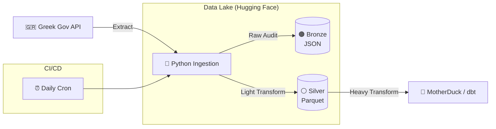

# 🚗 Attica Traffic Analysis


<p align="center">
  
</p>

<h1 align="center">Attica Traffic Analysis</h1>
<p align="center"><b>A high-performance, resilient ELT pipeline <br> designed to capture, archive and analyze daily traffic data from Attica, Greece.</b></p>
<p align="center">This project implements a Hybrid Medallion Architecture, <br> optimizing for both data fidelity and analytical speed. <br> By separating the "Extract & Load" (Python) from the "Transform" (dbt), <br> the pipeline ensures a robust source of truth <br> while keeping the analytics layer agile.</p>

<p align="center">
  <a href="https://www.python.org/"></a>
  <a href="https://docs.github.com/en/actions/"></a>
  <a href="https://huggingface.co/docs/datasets/index"></a>
  <a href="https://motherduck.com/"></a>
</p>

<p align="center">
  <a href="#-architecture-the-two-stage-landing">Architecture</a> |
  <a href="#-key-features">Key Features</a> |
  <a href="#-project-structure">Project Structure</a> |
  <a href="#-getting-started">Getting Started</a>
  <a href="#-roadmap">Roadmap</a>
</p>

---


## 🏗 Architecture: The Two-Stage Landing

The pipeline utilizes a **"Two-Stage Landing"** strategy to balance auditability with performance:

1. **Bronze (Raw Audit):** API responses are saved as **JSON** exactly as received. This preserves 100% of the source fidelity for future debugging or re-processing.
2. **Silver (Structured Landing):** Data is deduplicated, timestamped with metadata, and converted to **Parquet**. This "Light Silver" layer provides a structured, high-performance contract for **MotherDuck**.



---

## ✨ Key Features

### 1. Resilience-First Ingestion

* **Exponential Backoff:** Built-in retry logic (`1s, 2s, 4s...`) using `urllib3` to handle transient API instability.
* **Atomic Transactions:** Ingests data to a local staging area before performing a bulk upload to Hugging Face, ensuring no partial or corrupted files land in the lake.
* **CI/CD Awareness:** The `daily` command triggers a **Red 🔴 Alert** (Exit Code 1) on missing data, while the `backfill` command is fault-tolerant for historical recovery.

### 2. High-Performance "Light Silver" Layer

* **Hive-Style Partitioning:** Data is organized by `year=YYYY/month=MM/`. This allows MotherDuck to use **Partition Pruning**, making queries significantly faster and cheaper.
* **Deduplication at Source:** Python-side deduplication ensures that overlapping fetch windows don't pollute the data lake with redundant rows.
* **Vectorization Ready:** By landing data in Parquet, the pipeline enables DuckDB to use vectorized execution, skipping unnecessary rows and columns during the dbt transformation.

### 3. Separation of Concerns

* **Python (EL):** Handles networking, retries, partitioning, and file formats.
* **dbt (T):** Handles schema enforcement, type casting (e.g., `String`  `Float`), and business logic.
* **MotherDuck:** Provides a serverless cloud data warehouse for the final analytics.

### 4. Observability

This project uses `loguru` for professional-grade logging:

* **Formatted Console Logs:** Color-coded status updates for real-time monitoring.
* **File Rotation:** Logs are kept for **10 days** and rotated every **10 MB** to manage disk space.
* **GitHub Actions Integration:** Full traceback capture allows for rapid debugging of pipeline failures directly from the Actions UI.

---

## 📂 Project Structure

```text
attica-traffic-datalake/
├── .github/workflows/
│   └── daily_pipeline.yml    # Daily Cron & CI/CD logic
├── ingestion/
│   ├── logs/                 # Structured, rotated logs
│   └── ingestion.py          # The EL script
├── .env.example              # Secret template (HF_TOKEN)
├── pyproject.toml            # Centralized 'uv' dependencies
├── uv.lock                   # Deterministic environment
└── README.md
```

---

## 🚀 Getting Started

### Prerequisites

* Python 3.12
* [uv](https://github.com/astral-sh/uv) (Fast Python package manager)
* Hugging Face account with a **Write Token**

### Installation & Setup

1. **Clone & Sync:**
```bash
git clone https://github.com/TsilidisV/attica-traffic.git
cd attica-traffic
uv sync
```


2. **Environment Variables:**
```bash
cp .env.example .env
# Add your HF_TOKEN to the .env file
```


### Running the Pipeline

```bash
# Ingest yesterday's data (Standard Daily Run)
uv run python ingestion/ingestion.py daily

# Ingest a specific date
uv run python ingestion/ingestion.py daily --date-override 2024-05-20

# Historical Backfill (Processes in 7-day chunks)
uv run python ingestion/ingestion.py backfill 2024-01-01 2024-04-30
```

---

## 🗺 Roadmap

* [x] **Phase 1:** Resilient EL Pipeline (Python + GitHub Actions)
* [ ] **Phase 2:** Analytics Engineering (dbt + MotherDuck)
* [ ] **Phase 3:** Data Quality Observability (dbt-expectations)
* [ ] **Phase 4:** Interactive Visualizations (Streamlit)

